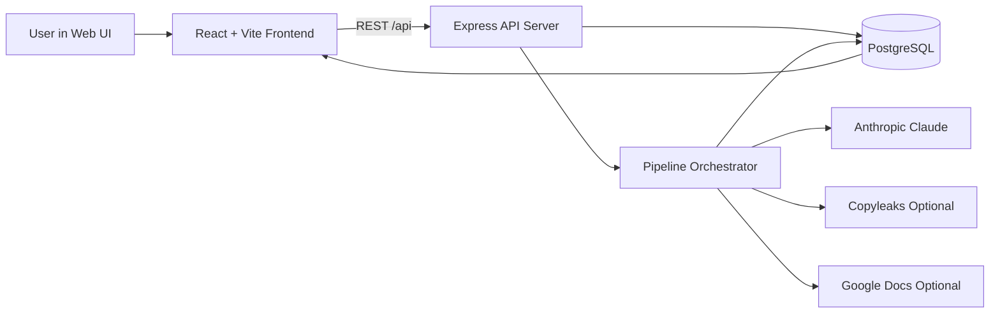
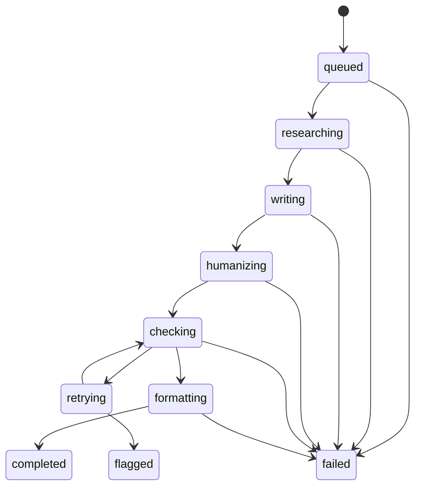
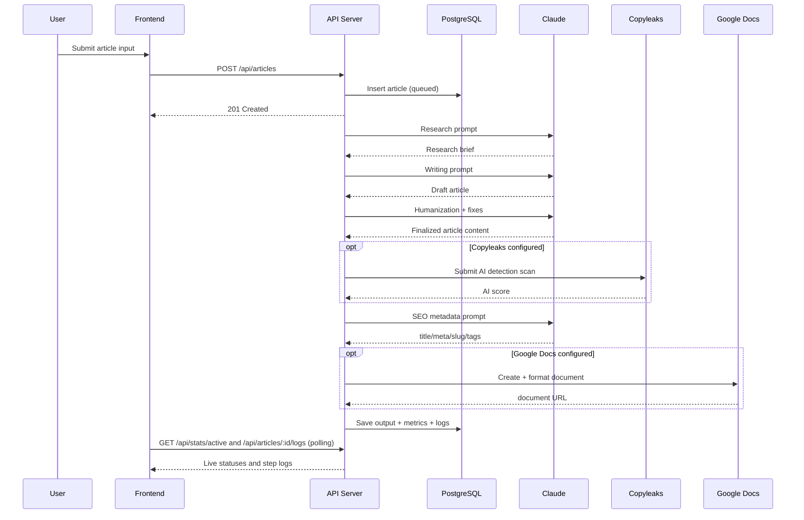

# 🚀 Blog Automator

<p align="center">
  <strong>AI-assisted blog production pipeline with real-time tracking, quality gates, and optional Google Docs publishing.</strong>
</p>

<p align="center">
  
  
  
  
  
  
</p>

---

> **Note on content below:** the "What this project does" section below is current. The architecture diagrams, sequence diagrams, and per-step detail further down the file describe an earlier pipeline shape (with Copyleaks, AI-signature retries, and humanization rules) that has been replaced. They are kept for historical context but should not be read as the current architecture. The authoritative description of the current flow is the feature list directly below.

## ✨ What this project does

Blog Automator runs an end-to-end blog generation workflow:

- Create a single article or batch (up to 3 concurrent) with optional **tone** (free-text — e.g. "Formal", "Authoritative", "Conversational, warm"), target audience, secondary keywords, and reference input
- Generate research briefs and article drafts with Claude
- **Verified-source citations**: a web-search step gathers real sources before writing. The writing step is constrained to cite ONLY from this list. After generation, every citation in the article is checked against the verified list and any that don't match are stripped automatically. This means citations in the published article are real (real URLs, real organizations); the model is not allowed to invent sources.
- **Strict word-count enforcement**: pipeline regenerates up to 2 times if the draft falls outside ±200 words of the target. After 2 retries that miss, the article ships with a `wordCountOutOfBand` warning flag
- Send drafts to the ZeroGPT humanizer in chunked mode (smart retry behavior; Claude fallback humanization runs if ZeroGPT fails)
- Score the final article with ZeroGPT's AI detector (the score is stored and shown in the UI)
- Apply lightweight safety-net checks: primary keyword density (1.0–2.5%), FAQ count (4–8), FAQ-body uniqueness (warns if FAQ answers duplicate body content), heading-keyword presence (30%+ of H2/H3 include primary, every heading has primary or secondary, 25%+ include a secondary when secondaries are provided — with one auto-fix attempt before flagging)
- Generate SEO metadata
- Optionally publish final content to Google Docs
- **Regenerate** any completed or flagged article from the article-detail page — creates a fresh new article record using the same inputs (topic, keywords, audience, tone, reference). The original article stays untouched.
- Track everything from dashboard + pipeline logs in real time

**Required environment variables:** `ANTHROPIC_API_KEY`, `ZEROGPT_API_KEY`, `DATABASE_URL`. Optional: `ZEROGPT_API_BASE_URL` (default `https://api.zerogpt.com`), `ZEROGPT_PARAPHRASE_PATH` (default `/api/transform/paraphrase`), `ZEROGPT_DETECT_PATH` (default `/api/detect/detectText`), `ZEROGPT_DEFAULT_TONE` (default `Standard` — fallback ZeroGPT tone preset when the user's free-text tone doesn't match a keyword), `ZEROGPT_GEN_SPEED` (default `quick` — `thinking` is VIP-tier only; invalid values auto-fallback to `quick`), `ZEROGPT_PARAPHRASE_TIMEOUT_MS` (default `90000`), `ZEROGPT_PARAPHRASE_TIMEOUT_PER_WORD_MS` (default `40`), `ZEROGPT_PARAPHRASE_TIMEOUT_CAP_MS` (default `300000`), `ZEROGPT_PARAPHRASE_MAX_WORDS` (default `3500`), `ZEROGPT_PARAPHRASE_MAX_CHARS` (default `30000`), `ENABLE_POST_HUMANIZATION_DENSITY_REBALANCE` (default `false`; set `true` to re-enable the post-humanization Claude density rewrite), `GOOGLE_SERVICE_ACCOUNT_JSON`.

**ZeroGPT auth note:** the API uses `ApiKey: <your-key>` as the auth header, not `Authorization: Bearer <key>`. The integration handles this internally — you only need to set `ZEROGPT_API_KEY`. The key comes from your dashboard at api.zerogpt.com.

**Tone mapping:** the user's free-text tone field (e.g. "Authoritative expert", "Friendly and warm") gets mapped to one of ZeroGPT's 10 valid paraphraser tones (Standard, Academic, Fluent, Formal, Simple, Creative, Engineer, Doctor, Lawyer, Teenager) via keyword matching. "Formal" → Formal, "Friendly" → Fluent, "Academic" → Academic, etc. Unmatched values fall back to `ZEROGPT_DEFAULT_TONE`.

**Note on web search:** the source-gathering step uses Anthropic's `web_search` tool, which is a paid API feature. Per article it makes ~5 search queries (cost typically $0.05–0.20 per article on top of normal token cost). If web search isn't available on your account, source gathering will fail gracefully and the article will be written without citations.

**Database migration:** after pulling this version, run `drizzle-kit generate` then `drizzle-kit push` to add the `tone`, `word_count_out_of_band`, `verified_sources`, `citation_count`, `unverified_citations_removed`, `zero_gpt_score`, and `humanization_failed` columns to the `articles` table. Legacy columns (`copyleaks_score`, `burstiness_score`, etc.) are kept for backward compatibility with existing rows but are no longer written by the pipeline.

---

## 🧭 Quick navigation

- [Architecture graph](#-architecture-graph)
- [Pipeline state graph](#-pipeline-state-graph)
- [Request sequence graph](#-request-sequence-graph)
- [Monorepo structure](#-monorepo-structure)
- [How it really works (full logic)](#-how-it-really-works-full-logic)
- [Data model](#-data-model)
- [Environment variables](#-environment-variables)
- [Local development](#-local-development)
- [API endpoints](#-api-endpoints)
- [Build & deployment](#-build--deployment)
- [Troubleshooting](#-troubleshooting)

---

## 🏗️ Architecture graph



---

## 🔄 Pipeline state graph



---

## 🧵 Request sequence graph



---

## 📦 Monorepo structure

```text
/home/runner/work/Blog_Automator/Blog_Automator
├─ artifacts/
│  ├─ api-server/          # Express API + pipeline orchestrator
│  ├─ blog-automation/     # React frontend (Vite)
│  └─ mockup-sandbox/      # UI sandbox artifact
├─ lib/
│  ├─ db/                  # Drizzle schema + DB connection
│  ├─ api-spec/            # OpenAPI contract + Orval config
│  ├─ api-zod/             # Generated Zod validators/types
│  └─ api-client-react/    # Generated React Query client
├─ scripts/
├─ render.yaml
└─ pnpm-workspace.yaml
```

### Tech stack

- **Runtime:** Node.js 22+
- **Package manager:** pnpm
- **Language:** TypeScript
- **Backend:** Express 5 + Drizzle ORM + PostgreSQL
- **Frontend:** React + Vite + TanStack Query + Wouter
- **Validation/codegen:** OpenAPI + Orval + Zod
- **AI provider:** Anthropic (Claude)
- **Optional integrations:** Copyleaks + Google Docs/Drive API

---

## 🧠 How it really works (full logic)

### 1) Article creation and queueing

Frontend (`/new`) sends:
- `POST /api/articles` (single)
- `POST /api/articles/batch` (batch)

Server (`artifacts/api-server/src/routes/articles.ts`):
- validates payload with generated Zod schemas
- enforces **maximum 3 active pipeline articles**
- inserts rows with `queued` status
- starts async execution via `setImmediate(() => runPipeline(articleId))`

### 2) Pipeline statuses and terminal outcomes

Main progression:

`queued → researching → writing → humanizing → checking → retrying → formatting → completed`

Terminal outcomes:
- `failed` = hard failure
- `flagged` = still above Copyleaks threshold after max retries

Each step writes a row to `pipeline_logs`, which powers real-time UI logs.

### 3) Pipeline execution (`runPipeline` in `pipeline.ts`)

#### A. Startup checks
- fetch article from DB
- require `ANTHROPIC_API_KEY`
- fail fast if missing

#### B. Research generation
- Claude produces a research brief with:
  - 5–7 section outline
  - audience pain points
  - content gaps
  - facts/stats
  - FAQ ideas
  - differentiating angle

#### C. Article drafting
- Claude writes the main article with enforced constraints:
  - heading structure (H1/H2/H3)
  - keyword targeting
  - formatting variety
  - FAQ section format and uniqueness
  - anti-pattern bans (including em-dashes)

#### D. Humanization pass
- Claude rewrites to reduce detectable AI patterns while preserving structure.

#### E. Subheading safety pass
- detects negative-framing headings
- rewrites only flagged H2/H3 headings to neutral SEO-safe forms

#### F. Section-structure de-duplication
- detects repetitive adjacent H2 section patterns
- restructures repeated sections while preserving meaning/data

#### G. Quality checks
- word count
- primary/secondary keyword density
- em-dash count
- FAQ count

#### H. Copyleaks check (optional)
If configured:
- submit content to Copyleaks
- if score > 10%, rewrite and retry up to 3 times
- if still >10% after retries → mark `flagged`

If not configured, step is skipped.

#### I. SEO metadata generation
- generates title, meta description, slug, tags
- falls back to defaults on parsing failure

#### J. Google Docs publishing (optional)
If configured:
- create Google Doc
- convert markdown-like content to structured docs operations
- insert headings, bullets, and tables
- optionally move to target Drive folder
- store resulting URL + document name

#### K. Completion
- persist final content, metrics, SEO fields, retry count, timestamps
- mark article `completed`

### 4) Real-time UI behavior

- **Dashboard:** polls summary stats + active pipeline cards
- **Pipeline Status:** auto-refreshes every 3s, expandable logs
- **History:** full article table, filtering, retry, delete
- **Article Detail:** content, SEO, logs, and quality scorecards

### 5) API-contract-first flow

Source of truth:
- `lib/api-spec/openapi.yaml`

Codegen:
- `pnpm --filter @workspace/api-spec run codegen`
- outputs:
  - `lib/api-client-react` (React Query hooks)
  - `lib/api-zod` (runtime schemas/types)

This keeps backend validation and frontend consumption in sync.

---

## 📊 Quality gate summary

| Metric | Target | Used for pass/fail |
|---|---:|---|
| Copyleaks AI Score | `< 10%` | Retry or flag if too high |
| Primary keyword density | `1.3% – 1.7%` | SEO quality check |
| Em-dash count | `0` | strict style rule |
| FAQ count | `5 – 8` | content completeness |

---

## 🗃️ Data model

### `articles`
Stored fields include:
- input metadata (topic, keywords, audience, target words)
- pipeline status + retries + error info
- generated content
- quality metrics
- SEO metadata
- optional Google Docs fields
- created/completed timestamps

Schema:
- `lib/db/src/schema/articles.ts`

### `pipeline_logs`
Stored fields include:
- `articleId`
- `stepName`
- `status` (`running` / `completed` / `failed`)
- details
- timestamp

Schema:
- `lib/db/src/schema/pipeline-logs.ts`

---

## 🔐 Environment variables

### Required
- `DATABASE_URL` — PostgreSQL connection string
- `PORT` — server port (in Render, injected automatically)
- `ANTHROPIC_API_KEY` — required for pipeline generation

### Optional
- `COPYLEAKS_EMAIL`
- `COPYLEAKS_API_KEY`
- `GOOGLE_SERVICE_ACCOUNT_JSON` (full service account JSON as string)
- `GOOGLE_DRIVE_FOLDER_ID`
- `STATIC_FILES_PATH` (override frontend static path)
- `BASE_PATH` (frontend base path, default `/`)
- `HOST`, `LOG_LEVEL`, `NODE_ENV`

---

## 🛠️ Local development

### 1) Prerequisites
- Node.js 22+
- pnpm
- PostgreSQL

### 2) Install

```bash
cd /home/runner/work/Blog_Automator/Blog_Automator
pnpm install
```

### 3) Configure environment
Set at least:
- `DATABASE_URL`
- `PORT`
- `ANTHROPIC_API_KEY`

### 4) Prepare DB schema

```bash
pnpm --filter @workspace/db run push
```

### 5) Run services

API:
```bash
pnpm --filter @workspace/api-server run dev
```

Frontend:
```bash
pnpm --filter @workspace/blog-automation run dev
```

### 6) Useful commands

```bash
pnpm run typecheck
pnpm run build
pnpm --filter @workspace/api-spec run codegen
```

---

## 🌐 API endpoints

Health:
- `GET /api/healthz`

Articles:
- `GET /api/articles`
- `POST /api/articles`
- `POST /api/articles/batch`
- `GET /api/articles/:id`
- `DELETE /api/articles/:id`
- `POST /api/articles/:id/retry`
- `GET /api/articles/:id/logs`

Stats:
- `GET /api/stats/dashboard`
- `GET /api/stats/active`

Full contract:
- `lib/api-spec/openapi.yaml`

---

## 🚢 Build & deployment

Render blueprint:
- `render.yaml`

Default Render commands:
- Build: `pnpm install && pnpm --filter @workspace/db run push && pnpm -r --if-present run build`
- Start: `node --enable-source-maps ./artifacts/api-server/dist/index.mjs`

Deployment notes:
- Render injects `PORT`; do not hardcode it there
- ensure `DATABASE_URL` is linked
- schema push is run automatically during the build command

---

## 🧯 Troubleshooting

### Pipeline fails immediately
Check:
- `ANTHROPIC_API_KEY`
- `DATABASE_URL`

### Article status becomes `flagged`
Copyleaks score remained above threshold after max retries; manual review is expected.

### Google Doc is not created
Check:
- valid `GOOGLE_SERVICE_ACCOUNT_JSON`
- Google Docs + Drive APIs enabled
- Drive folder shared with service-account email

### Frontend not served by API process
Ensure build output exists at:
- `artifacts/blog-automation/dist/public`

or set `STATIC_FILES_PATH`.

---

## 🔎 Core file map

- Pipeline orchestrator: `artifacts/api-server/src/lib/pipeline.ts`
- Google Docs integration: `artifacts/api-server/src/lib/google-docs.ts`
- Article routes + stats: `artifacts/api-server/src/routes/articles.ts`
- App/server wiring: `artifacts/api-server/src/app.ts`
- DB schema: `lib/db/src/schema/*.ts`
- API contract: `lib/api-spec/openapi.yaml`
- Frontend screens: `artifacts/blog-automation/src/pages/*.tsx`

---

## 🔒 Security/ops notes

- Pino logger redacts auth/cookie headers
- Rate limits:
  - `/api/*` → 60 req/min
  - `/api/articles*` → 5 generation req/min
- Workspace includes supply-chain hardening (`minimumReleaseAge` in `pnpm-workspace.yaml`)
